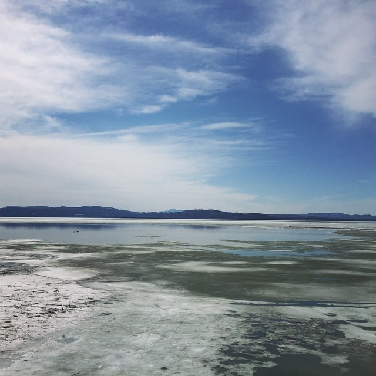

```{r setup, include=FALSE}
knitr::opts_chunk$set(echo = FALSE)
```

## First Slide

<center>  <center>

## Sequential bullet points

- First, ...
- Then, ...
- Finally, ...

## Simultaneous bullet points

>- First simultaneous
>- Second simultaneous
>- Third simultaneous

## Sequentially-highlighted bullet points (via simultaneous points)

>- \color{purple}First point

## Sequentially-highlighted bullet points (via simultaneous points)

>- \color{gray}First point
>- \color{purple}Second point

## Sequentially-highlighted bullet points (via simultaneous points)

>- \color{gray}First point
>- \color{gray}Second point
>- \color{purple}Third point

## Image with caption, small image, changing location

\begin{picture}(320,250)
\put(180,120){\includegraphics[height=3cm]
{Skyandlake.jpg}}
\put(165,105){\begin{minipage}[t]{.35\linewidth}
\textbf{Picture caption...trying greek letters $\theta$, $\alpha$, $\beta$, $\gamma$, $\epsilon$, $\delta$, $\omega$.}
\end{minipage}}
\end{picture}

## Caption on image

\begin{picture}(320,250)
\put(85,55){\includegraphics[height=6.5cm]
{Skyandlake.jpg}}
\put(90,80){\begin{minipage}[t]{.5\linewidth}
\textbf{\color{white}Picture caption...trying greek letters \color{green} $\theta$, $\alpha$, $\beta$, $\gamma$, $\epsilon$, $\delta$, $\omega$.}
\end{minipage}}
\end{picture}

## Side-by-side info

\begin{columns}
\begin{column}{0.5\textwidth}
\begin{description}
\item[$\bullet$] item 1
\item[$\bullet$] item 2
\item[$\bullet$] item 3
\end{description}
\end{column}
\begin{column}{0.5\textwidth}  %%<--- here
\begin{center}
\includegraphics[width=0.5\textwidth]{Skyandlake.jpg}
\end{center}
\end{column}
\end{columns}
