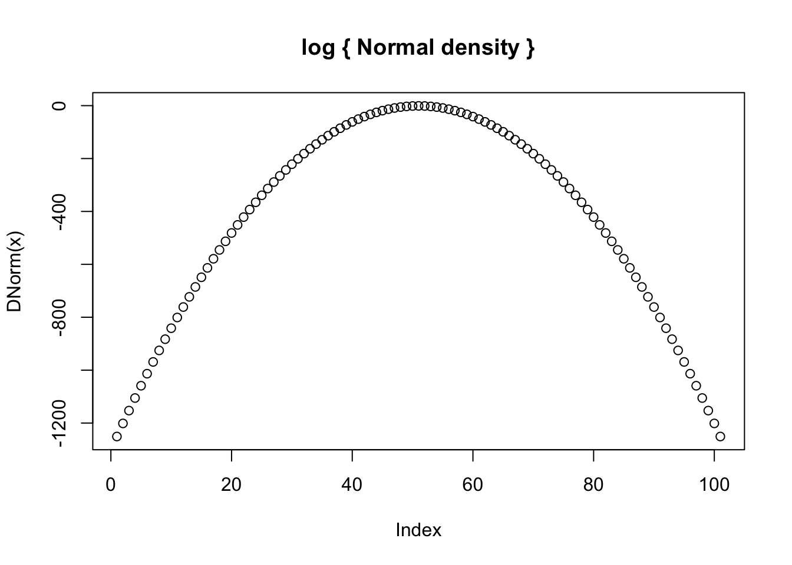
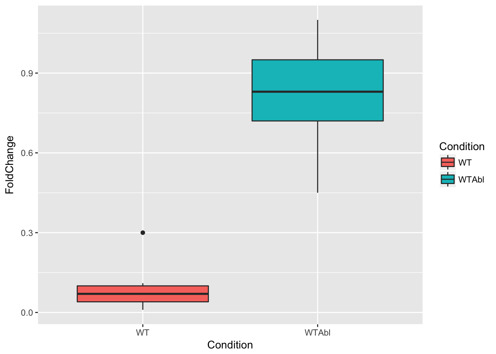

## Writing functions for equations


```r
library(ggplot2)
library(TeachingDemos)
char2seed("Cruel April")
##################################################
# function: DNorm
# DNorm dist
# input: x is the vector of quantiles, m = vector of means, sd = vector of standard deviations
# output: S is a vector of species richness values
#------------------------------------------------- 

DNorm <- function(x=-50:50,m=0,sd=1){
  
  dNorm <- dnorm(x, mean=m,sd=sd,log = TRUE)
return(dNorm)
}
##################################################

head(DNorm())
```

```
## [1] -1250.919 -1201.419 -1152.919 -1105.419 -1058.919 -1013.419
```

```r
##################################################
# function: DNormPlot
# plot DNorm distribution
# input: 
# output: smoothed curve with parameters in graph
#------------------------------------------------- 
DNormPlot <- function(x=-50:50,m=0,sd=1) {
  plot(DNorm(x),main = "log { Normal density }")
  return()
}
##################################################

DNormPlot()
```



```
## NULL
```

## Randomization test


```r
####################################################
# Function: readData
# read in data frame
# input: file name (or nothing for the demo)
# output: 3-column data frame of observed data (ID, xVar, yVar)
#---------------------------------------------------
readData <- function(z=NULL) {
  if(is.null(z)){
    d <- read.table(file="testData.csv",header=TRUE,sep=",")
  }
  return(d)
}
####################################################

####################################################
# Function: plotData
# ggplot graph
# input: list of observed metric
# output: ggplot graph
#---------------------------------------------------
plotData <- function(z=NULL) {
  if(is.null(z)){
    d <- read.table(file="testData.csv",header=TRUE,sep=",")
  }
  p1 <- ggplot(data=d,aes(x=Condition,y=FoldChange,fill=Condition)) + geom_boxplot()
  return(print(p1))
  
}
###################################################
plotData()
```



```r
####################################################
# Function: getMetric
# calculates variance
# input: 3-column dF for regression
# output: regression slope
#---------------------------------------------------
getMetric <- function(z=NULL) {
  if(is.null(z)){
     d <- read.table(file="testData.csv",header=TRUE,sep=",")
  }
  
  . <- aov(FoldChange~Condition,data=d) 
  . <- summary(.)[[1]][["Pr(>F)"]][[1]]
  pVal <- .
  
  return(pVal)
}

getMetricRandom <- function(d=shuffleData()) {

  . <- aov(FoldChange~Condition,data=d) 
  . <- summary(.)[[1]][["Pr(>F)"]][[1]]
  pVal <- .
  
  return(pVal)
}
####################################################

getMetric()
```

```
## [1] 1.522155e-08
```

```r
####################################################
# Function: shuffleData
# randomize data for variance analysis
# input: 2-column data frame (xVar,yVar)
# output: 2-column data frame (xVar,yVar)
#---------------------------------------------------
shuffleData <- function(z=NULL) {
  if(is.null(z)){
   z <- read.table(file="testData.csv",header=TRUE,sep=",")
   }
    z[,2] <- sample(z[,2])
 
  return(z)
}
####################################################

shuffleData()
```

```
##    Condition FoldChange
## 1         WT       1.10
## 2         WT       0.83
## 3         WT       0.01
## 4         WT       0.95
## 5         WT       0.87
## 6         WT       0.06
## 7         WT       0.69
## 8         WT       0.76
## 9         WT       0.72
## 10     WTAbl       0.09
## 11     WTAbl       0.30
## 12     WTAbl       0.45
## 13     WTAbl       0.02
## 14     WTAbl       0.07
## 15     WTAbl       0.10
## 16     WTAbl       0.04
## 17     WTAbl       0.11
## 18     WTAbl       0.98
```

```r
####################################################
# Function: getPVal
# calculate p-value for observed, simulated data
# input: list of observed metric and vector of simulated metric
# output: lower, upper tail probability vector
#---------------------------------------------------
getPVal <- function(z=NULL) {
  if(is.null(z)){
    z <- list(xObs=runif(1),xSim=runif(1000))
  }
  
  pLower <- mean(z[[2]]<=z[[1]]) # mean of the second element (vector), when it's less than or equal to the first element (observed)
  pUpper <- mean(z[[2]]>=z[[1]])
  
  return(c(pL=pLower,pU=pUpper))
}
####################################################

getPVal()
```

```
##    pL    pU 
## 0.054 0.946
```

```r
####################################################
# Function: plotRanTest
# ggplot graph
# input: list of observed metric and vector of simulated metric
# output: ggplot graph
#---------------------------------------------------
plotRanTest <- function(z=NULL) {
  if(is.null(z)){
    z <- list(xObs=runif(1),xSim=runif(1000))
  }
  
  dF <- data.frame(ID=seq_along(z[[2]]),
                   xSim=z[[2]])
  p1 <- ggplot(data=dF,mapping=aes(x=xSim))
  p1 + geom_histogram(mapping=aes(fill=I("goldenrod"),color=I("black"))) + geom_vline(aes(xintercept=z[[1]],col="blue"))
  return(print(p1))
  
}
###################################################

#---------------------------------------------------
# Main body of the code

nSim <- 1000 # number of simulations
xSim <- rep(NA,nSim)

d <- readData()

xObs <- getMetric(d)
xObs
```

```
## [1] 1.522155e-08
```

```r
for(i in seq_len(nSim)){
  xSim[i] <- getMetricRandom()
}

slopes <- list(xObs,xSim)
getPVal(slopes)
```

```
## pL pU 
##  0  1
```

