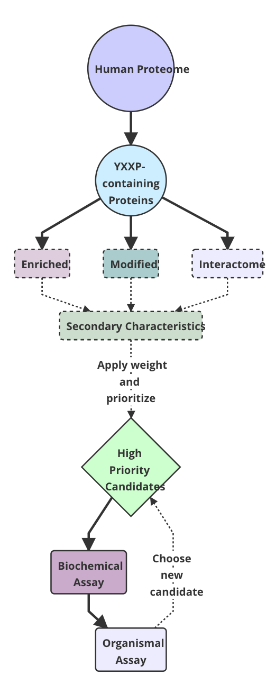
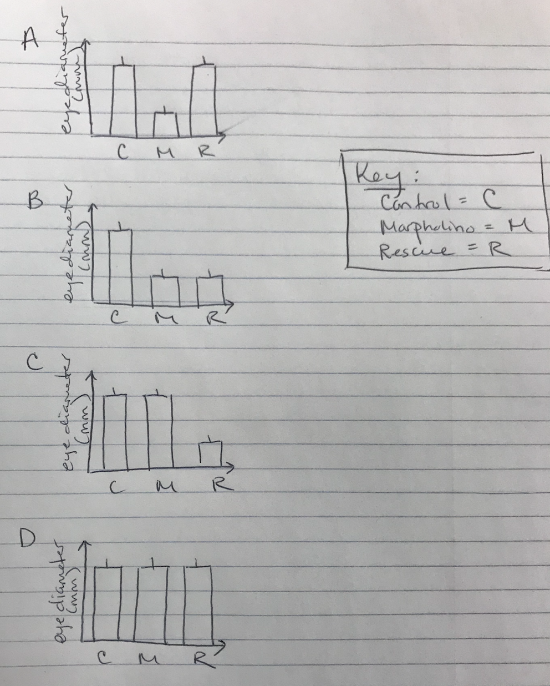

   
Item 1. Logic tree outlining the flow of an *in silico* proteomics screen to identify protein-protein interactions dependent upon motif modifications. Rather than limiting the screen to all proteins expressed in a particular cell type or tissue, this *in silico* approach is expanded to encompass the entire proteome of any organism of interest. This example uses the binding motif of the SH2 domain of the adaptor protein CRKL, which binds preferentially to phosphorylated tyrosine residues in YXXP motifs.   

   
Item 2. Early graphs outlining four possible outcomes of a knockdown experiment in which a gene that is important in zebrafish eye development is knocked down with a morpholino, and a rescue is attempted by the addition of wild-type mRNA. The possible outcomes are as follows: A) knockdown of the gene results in a decrease in eye size, and the phenotype is rescued by the addition of wild-type mRNA, B) knockdown of the gene results in a decrease in eye size, but the phenotype is not rescued by the addition of wild-type mRNA, C) knockdown of the gene does not result in a decrease in eye size, but overexpression of the gene (the addition of wild-type mRNA) does result in decreased eye size, and D) there is no effect on eye size when the gene is knocked down or overexpressed.